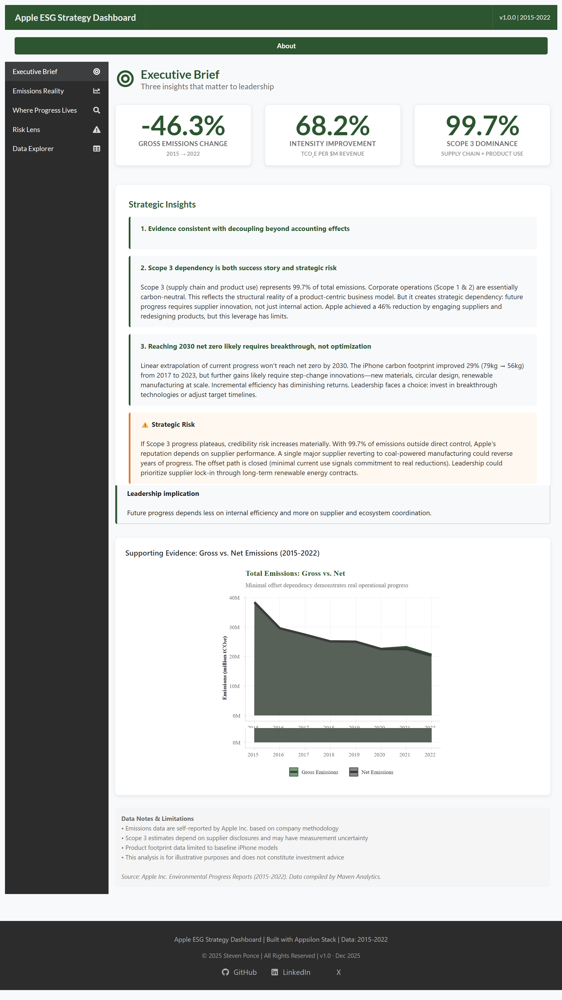
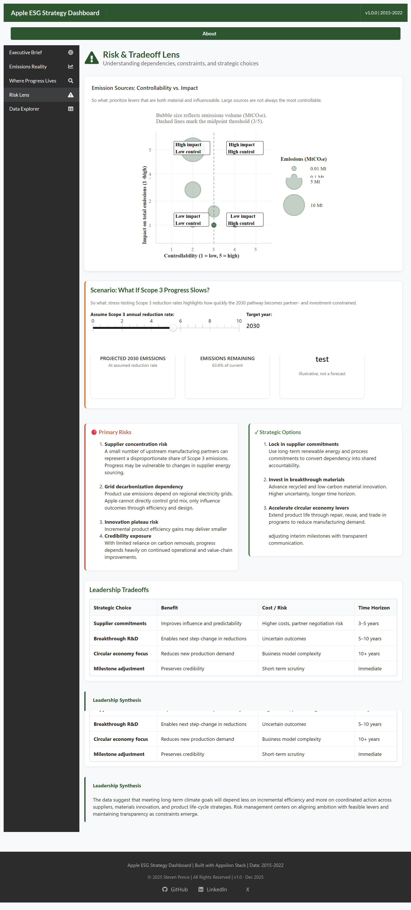
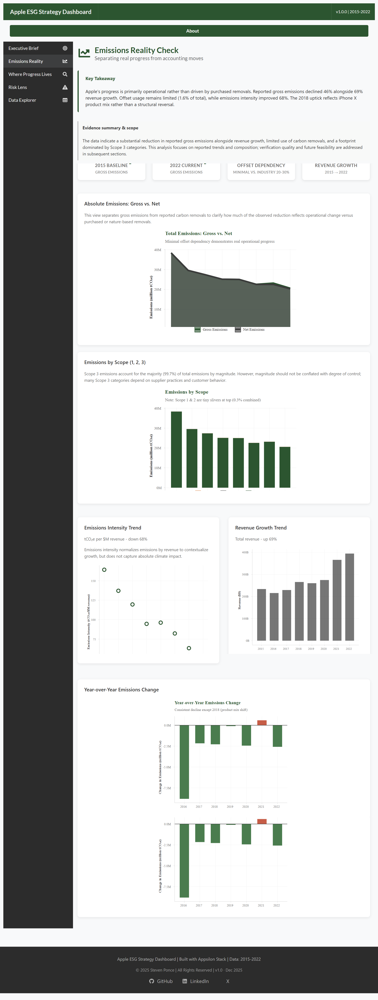

# Apple ESG Strategy Dashboard

A strategic analysis dashboard examining Apple’s reported greenhouse gas emissions (FY2015–FY2022) and the underlying drivers of reduction. The dashboard is designed as an executive-facing decision support artifact—highlighting what has changed, what drove progress, and where strategic risk remains as Apple approaches its 2030 carbon neutrality goal.

   

## Executive Framing

The dashboard is intentionally structured around three leadership-level questions:

1.  Has Apple shown evidence of decoupling growth from emissions?
2.  Where does progress depend on external actors rather than internal control?
3.  What risks and tradeoffs shape the path to 2030 net zero?

The opening Executive Brief synthesizes these questions into three KPIs and three strategic insights, supported by progressively deeper analysis. Together, these questions frame the dashboard not as a scorecard, but as a tool for evaluating strategic feasibility and risk.

🔗 **Live Dashboard:**\
[Apple ESG Strategy Dashboard on shinyapps.io](https://0l6jpd-steven-ponce.shinyapps.io/Apple_ESG/)

## Tools and Technologies

-   **R Shiny + shiny.semantic (Appsilon)** \| Modern UI framework based on Semantic UI
-   **ggiraph** \| Interactive visualizations with consistent hover tooltips
-   **reactable** \| Professional data tables with search and CSV download
-   **ggplot2 + scales** \| Custom statistical graphics and formatting
-   **dplyr + tidyr** \| Data transformation and feature engineering
-   **bindCache** \| Performance optimization through reactive caching

------------------------------------------------------------------------

## I. Business Context

Corporate ESG commitments are increasingly scrutinized by investors, regulators, and stakeholders. Apple's 2030 carbon neutrality pledge represents one of the technology sector's most ambitious climate goals, spanning a global supply chain of hundreds of suppliers and billions of devices.

However, ESG reporting often focuses on absolute metrics without strategic context. This dashboard was developed to transform Apple's publicly reported emissions data into a **strategic decision-support tool** that addresses three critical questions:

### Key Strategic Questions

-   **Where has real progress occurred?** Distinguishing operational emissions reductions from reported changes driven by carbon removals or accounting treatment
-   **What are the controllability constraints?** Understanding which emission sources Apple can directly influence versus those requiring supplier cooperation or customer behavior change
-   **What tradeoffs does leadership face?** Analyzing the strategic choices between breakthrough investment, timeline adjustment, and stakeholder expectations

### Target Personas

**Strategic Decision-Makers** — Assess progress against stated goals, understand risk dependencies, and evaluate strategic options

**ESG Analysts** — Analyze emissions trends, scope breakdowns, and offset usage patterns with interactive filters

**Sustainability Professionals** — Examine product-level footprint improvements, supplier engagement impact, and controllability frameworks

### Strategic Value

By applying risk-based frameworks and consulting methodologies to publicly available data, this dashboard:

-   Demonstrates how to structure ESG analysis for executive audiences
-   Provides a replicable framework for analyzing corporate climate commitments
-   Showcases ability to communicate complex sustainability topics with clarity and precision
-   Illustrates how ESG analysis can be structured for executive and corporate strategy audiences.

------------------------------------------------------------------------

## II. Dataset Summary

| Attribute | Details |
|------------------------------------|------------------------------------|
| **Source** | Apple Environmental Progress Reports via Maven Analytics |
| **Time Period** | Fiscal Years 2015–2022 |
| **Scope Coverage** | Scope 1, 2, and 3 emissions across corporate and product life cycle |
| **Key Metrics** | Gross Emissions, Carbon Removals, Net Emissions, Revenue, Emissions Intensity |
| **Geographic Scope** | Global operations and supply chain |
| **Data Quality** | Publicly reported using Apple’s disclosed methodology; some elements may be subject to third-party assurance per Apple disclosures. |

### Dataset Characteristics

-   **Emissions Categories**: Corporate operations vs. Product life cycle emissions
-   **Scope Breakdown**: Direct operations (Scope 1/2) vs. Value chain (Scope 3)
-   **Product Detail**: iPhone carbon footprint trend (2015-2023)
-   **Normalizing Factors**: Revenue growth for emissions intensity analysis
-   **Carbon Removals**: Purchased offsets and nature-based solutions (reported separately from gross emissions)

------------------------------------------------------------------------

## Dashboard Preview

### Executive Brief



### Risk & Tradeoff Lens



### Emissions Reality Check



*Additional tabs: Where Progress Lives (controllability framework), Data Explorer (interactive filtering)*

------------------------------------------------------------------------

## III. Dashboard Architecture

### Design Philosophy

**Consulting-Grade Communication** — Lead with strategic insights, support with data, avoid jargon

**Risk-Based Frameworks** — Controllability analysis, scenario planning, strategic option evaluation

**Progressive Disclosure** — Executive summary → detailed analysis → risk assessment → raw data access

**Modern Professional Aesthetic** — Forest green/charcoal color scheme, clean typography, enterprise UI patterns

### Dashboard Structure

**Tab 1: Executive Brief** - Three strategic insights synthesized from the data - High-level KPIs (emissions change, intensity improvement, Scope 3 dominance) - Risk callout highlighting strategic dependencies - Supporting chart (Gross vs. Net emissions trend)

**Tab 2: Emissions Reality Check** - Key takeaway box with consulting-style summary - Four summary metrics (baseline, current, offset usage, revenue growth) - Emissions by scope (stacked bar showing Scope 3 dominance) - Side-by-side intensity and revenue trends - Year-over-year change visualization

**Tab 3: Where Progress Lives** - Corporate vs. Product Life Cycle split - Top Scope 3 emission sources - iPhone carbon footprint improvement trend - Controllability analysis grid (High/Medium/Low control framework)

**Tab 4: Risk & Tradeoff Lens** - Risk matrix scatter plot (Controllability × Impact) - Interactive scenario analysis ("What if Scope 3 stalls?") - Primary risks vs. Strategic options comparison - Leadership tradeoffs table with time horizons - Recommended approach synthesis

**Tab 5: Data Explorer** - Interactive reactable with year/category/scope filters - Summary statistics (records, gross emissions, net emissions) - CSV download for further analysis - Full data transparency for analyst deep-dives

------------------------------------------------------------------------

## IV. Key Insights and Findings

### Headline Findings

| Metric | Value | Context |
|------------------------|------------------------|------------------------|
| Gross Emissions Reduction | –46% (FY2015–FY2022, gross emissions) | Alongside +69% revenue growth |
| Emissions Intensity Improvement | -68% | From 177 to 56 tCO₂e/\$M revenue |
| Scope 3 Contribution | \~99% (FY2022) | Value chain dominates footprint |
| Offset Dependency | 1.6% | Minimal reliance on carbon credits |
| iPhone Footprint Improvement | -29% (2017-2023) | 79kg → 56kg per device |

*Percent change reflects gross emissions totals reported for FY2015 and FY2022. Figures are rounded; see Data Explorer for exact values.*

### Strategic Observations

**Real Progress, Real Constraints**

Apple's \~46% emissions reduction occurred during a period of significant revenue growth (+69%), demonstrating decoupling of business performance from carbon footprint. However, the Scope 3 dependency (99.7%) means future progress increasingly relies on supplier cooperation and industry-wide material innovations.

**The Offset Question**

With only 1.6% offset usage, a majority of Apple’s reported reductions reflect operational changes rather than purchased removals. This strengthens credibility but also means there's minimal "low-hanging fruit" remaining. The path forward requires harder choices.

**Diminishing Returns on Incremental Efficiency**

The iPhone carbon footprint improvement (29% over 6 years) demonstrates consistent progress, but the trend suggests diminishing returns. Going from 79kg to 56kg required years of R&D investment. Achieving a comparable next-step reduction would likely require breakthrough materials or circular design approaches with uncertain timelines and costs.

------------------------------------------------------------------------

## V. Reflection and Learning Outcomes

### Technical Skills Demonstrated

This project showcases proficiency in:

-   **Strategic Analytics** — Risk frameworks, scenario analysis, controllability assessment
-   **Modern R Shiny Development** — Modular architecture, reactive programming, bindCache optimization
-   **Executive Communication** — Consulting-style insights, clear visual hierarchy, appropriate hedging
-   **Data Visualization** — ggiraph interactivity, color theory, chart type selection
-   **Software Engineering** — Git workflow, code organization, reproducible data pipelines

### Business Skills Developed

This project demonstrates ability to:

-   **Apply consulting frameworks** to real-world business problems (risk matrix, option evaluation)
-   **Communicate strategic tradeoffs** without prescriptive directives
-   **Structure complex analysis** for executive audiences with progressive disclosure
-   **Balance technical depth with accessibility** through persona-driven tab design
-   **Acknowledge uncertainty** professionally while maintaining analytical rigor

### Key Learnings

**1. Consulting Language Matters**

The difference between "demands breakthrough materials" and "likely requires breakthrough materials" is subtle but critical. The former sounds like overreach; the latter demonstrates professional judgment. Consulting-grade communication avoids absolutes and instead emphasizes “should,” acknowledges constraints, and frames recommendations as options rather than directives.

**2. Risk-Based Frameworks Elevate Portfolio Projects**

Many ESG dashboards show charts without context. By applying a controllability framework and risk matrix, this project demonstrates strategic thinking—the ability to structure ambiguous problems using established analytical tools. This signals consulting aptitude to hiring managers.

**3. Modern Frameworks Signal Industry Awareness**

Using shiny.semantic instead of shinydashboard, implementing bindCache for performance, and following modular architecture patterns signals awareness of current R Shiny best practices. This matters for roles requiring modern tech stack experience.

------------------------------------------------------------------------

## VI. Quick Start Guide

### Installation

``` r
# Install required packages
install.packages(c(
  "shiny", "shiny.semantic", "shinydashboard", "shinyjs",
  "dplyr", "tidyr", "ggplot2", "ggiraph", "reactable",
  "scales", "glue", "forcats", "waiter"
))
```

### Running Locally

``` r
# Clone the repository
git clone https://github.com/poncest/apple-esg-dashboard.git
cd apple-esg-dashboard

# Run data preparation (first time only)
source("data_preparation.R")

# Launch the app
shiny::runApp()
```

### Project Structure

```         
apple-esg-dashboard/
├── app.R                          # Main application
├── global.R                       # Data loading
├── data_preparation.R             # Data pipeline
├── modules/                       # 5 tab modules
├── R/                             # Helper functions
├── data/
│   ├── raw/                       # Source CSV files
│   └── processed/                 # Generated RDS files
├── www/css/                       # Custom styling
└── README.md
```

------------------------------------------------------------------------

## VII. Contact and Links

**Steven Ponce**\
Data Analyst \| R Shiny Developer \| Business Intelligence Specialist

🔗 **Portfolio Website**: [stevenponce.netlify.app](https://stevenponce.netlify.app/projects.html)\
🐙 **GitHub**: [\@poncest](https://github.com/poncest)\
💼 **LinkedIn**: [stevenponce](https://www.linkedin.com/in/stevenponce/)\
🐦 **X (Twitter)**: [\@sponce1](https://x.com/sponce1)

------------------------------------------------------------------------

## VIII. License and Disclaimer

**License**: MIT License - Feel free to use this code for learning or portfolio purposes.

**Disclaimer**: This is a portfolio demonstration project using publicly available data for analytical skill showcase purposes. It is not affiliated with Apple Inc., any ESG rating agency, or sustainability consultancy. All insights and recommendations are illustrative examples demonstrating analytical capabilities and strategic thinking frameworks.

**Data Source**: Apple Environmental Progress Reports (2015-2022) compiled by Maven Analytics for educational use. Analysis and interpretations are independent work product.

------------------------------------------------------------------------

> **Project Published**: December 2025\
> **Last Updated**: December 21, 2025\
> **Version**: 1.0.0

------------------------------------------------------------------------

## Acknowledgments

-   **Maven Analytics** — For compiling the Apple ESG dataset
-   **Appsilon** — For developing shiny.semantic and modern Shiny design patterns
-   **Apple Inc.** — For transparent ESG reporting and publicly available environmental progress data

## Scope and Limitations

This project is a portfolio demonstration based on publicly available corporate disclosures. It does not provide independent verification of emissions data, ESG ratings, or investment recommendations. Scenario analyses are illustrative and intended to support strategic discussion rather than prediction.

Any references to Apple Inc. are for analytical illustration only and do not imply endorsement or validation.
